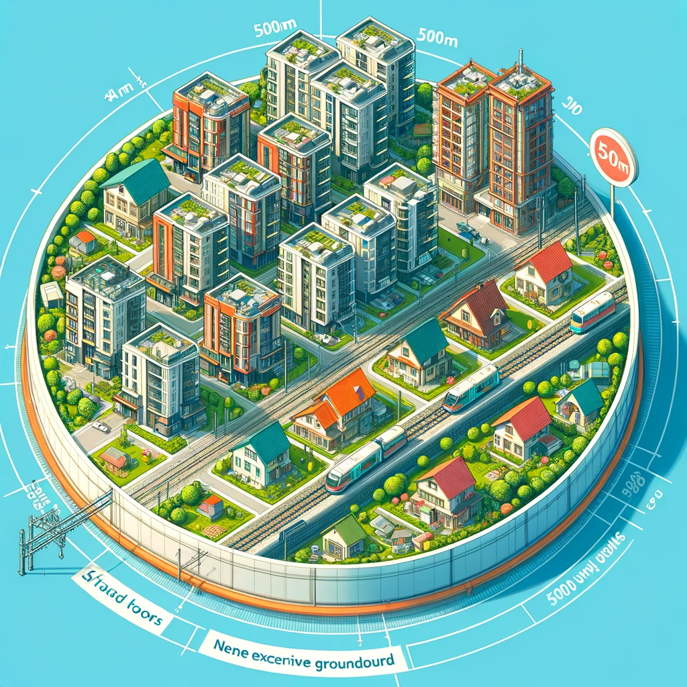

# Upzoning for all 

As detailed in _[Melbourne's Missing Middle](https://yimbymelbourne.org.au/missing-middle)_, broad upzoning is the best, most equitable approach to creating housing abundance for all. 

Our proposed city-wide upzoning is focused around Melbourne's extensive train and tram networks, with the goal of enabling more people to utilise our city's existing infrastructure, and to live in the places that enable them to experience the best Melbourne has to offer. 


## How zoning will change

```{r}

dwellings_by_type <- df_mel_props %>%
  group_by(category) %>% 
  summarise(n = n(),
            lot_size = sum(lot_size),
            .groups = "drop") %>% 
  group_by(category) %>% 
  mutate(n_total = sum(n),
         lot_size_total = sum(lot_size))  %>% 
  ungroup() %>%
  mutate(zone_type = "Existing zoning")

dwellings_by_mm_type <- df_mel_props %>%
  group_by(category_new) %>% 
  summarise(n = n(),
            lot_size = sum(lot_size),
            .groups = "drop") %>% 
  group_by(category_new) %>% 
  mutate(n_total = sum(n),
         lot_size_total = sum(lot_size))  %>% 
  ungroup() %>%
  mutate(zone_type = "Missing Middle Zoning") %>%
  rename(category = category_new)

library(scales)

dwellings_by_type %>% 
  bind_rows(dwellings_by_mm_type) %>% 
  ungroup() %>%
    mutate(category = fct_relevel(category,"Low density residential")) %>% 
  filter(!(category %in% c("Housing not permitted","Civic use makes development less likely","Already developed"))) %>% 
  ggplot(aes(x = category, 
             y = n))+
  coord_flip()+ 
  geom_bar(stat = "identity")+
  theme_yimby_mel_caption(text_size = "small",plot_type = "bar",colour_scale = "light_dark") +
  labs(x = element_blank(),
       title = paste0("Building heights on Melbourne's residential lots"),
       y = "Number of properties",
       fill = "Heritage status") +
  facet_wrap(~zone_type) +
  scale_y_continuous(labels = scales::number_format(scale_cut = cut_short_scale()))

```


We have taken existing zoning controls, and upzoned accordingly:

1. All lots within lower-density residential zones (including Neighbourhood Residential Zone (NRZ) and General Residential Zone (GRZ)) within 500m of a tram stop or 1km of a train station are rezoned to the six-storey Missing Middle Zone (MMZ).
2. Any lot in a General Residential Zone not near trams or trains is rezoned RGZ (Residential Growth Zone), but parking minimums remain unless council states otherwise. 
3. Any lot in a Neighbourhood Residential Zone not near trams or trains is rezoned GRZ, but parking minimums remain unless council states otherwise. 

The effect of these changes will be to upzone much of Melbourne's land, allowing more homes to be built within existing communities. 


```{r}
total = tbl_body %>% 
  summarise(`Current zoned capacity for new housing` = sum(`Current zoned capacity for new housing`),
            `New zoned capacity under Missing Middle` = sum(`New zoned capacity under Missing Middle`),
            `Yearly housing target` = sum(`Yearly housing target`),
            `Existing homes` = sum(`Existing homes`)
            ) %>% 
  mutate(`Increase in zoned capacity` = paste0(round(`New zoned capacity under Missing Middle`/`Current zoned capacity for new housing`,1),"x"),
         `Council` = "Total") %>% 
  mutate(`Current zoned capacity for new housing`  = prettyNum(round(`Current zoned capacity for new housing`,-3),big.mark = ","),
         `New zoned capacity under Missing Middle`  = prettyNum(round(`New zoned capacity under Missing Middle`,-3),big.mark = ","),
         `Existing homes` = prettyNum(`Existing homes`,big.mark = ","),
         `Yearly housing target` = prettyNum(round(`Yearly housing target`,-2),big.mark = ","),
         )

test_footer <- matrix(0, nrow=1, ncol=6)
colnames(test_footer) <- c('Total', total[1, 4],total[1, 1], total[1, 2], total[1, 5],total[1, 3])

summary_table = htmltools::withTags(table(
  id="summary-table",
  tableHeader(tbl_body),
  tableFooter(test_footer)
))


tbl_body %>% 
  mutate(across(c(`Current zoned capacity for new housing`,`New zoned capacity under Missing Middle`),~round(.x,-3)),
across(c(`Yearly housing target`,`Existing homes`),~round(.x,-2))) %>%
datatable(
  container = summary_table,
  options = list(dom = 't',
                 pageLength = 20
                 ),
  rownames = FALSE
) %>% 
  formatRound(columns = c(2,3,4,6), mark = ',',digits = 0) %>% 
  formatCurrency(columns = c(5), digits = 1,currency = "x", before = F)

```

## A new Missing Middle Zone



The Missing Middle Zone (MMZ) will enable 6 storey buildings to be built within walking distance of every train station and tram stop in Melbourne. This zone will support the density levels that underpin great and iconic cities across the world, with beautiful street walls free of onerous setback rules, activating the streets below. 

This new zone is a refinement of the existing Residential Growth Zone (RGZ), and has been altered in four key ways. The MMZ:

* Implements a default maximum height of 21 metres or 6 storeys, an increase from the RGZ’s current 4-storey default.
* Expands non-residential land uses to include a wider range of neighbourhood  services & amenities.
* Abolishes car parking minimums.
* Exempts from notice and review developments of any total value containing at least 10% public or community housing in perpetuity

MMZ areas will be entirely mixed-use, and buildings across the area will be permitted by-right to include neighbourhood services and amenities, cafes, libraries, and shops on the ground floor. Off-street parking will be allowed, but thanks to the absence of parking minimums, nobody will be forced to buy a car park that they don't need. 


## Upzoning Melbourne-wide

Not all of Melbourne's suburbs have access to rail infrastructure but many still benefit from nearby schools, hospitals and bus routes. Local communities and businesses that aren’t as closely situated to Melbourne’s vast train and tram networks also deserve to reap the densification benefits the Missing Middle reforms will provide. 

Inspired by the success of Auckland’s zoning reforms, the Missing Middle reform will completely eliminate the Neighbourhood Residential Zone (NRZ) across metropolitan Melbourne, replacing it with General Residential Zone (GRZ). In turn, all land currently zoned GRZ will also be upzoned to the Residential Growth Zone (RGZ).


## Creating excess zoned capacity

Purposefully limiting zoned capacity has two key problems: 

1. it limits housing development, and
2. it encourages land speculation.

### Enabling housing development

Under the current system, the zoned capacity of each LGA is kept only barely higher than the number of homes that need to be built.

But limiting zoned capacity relies on the impractical idea that every potential lot will be built to its maximum zoned capacity within a reasonable timeframe. 

This almost never happens, for several reasons:

* Some sites are too difficult or expensive to build on 
* Some sites have existing vital community or commercial functions and cannot be turned into more housing
* Some owners enjoy their homes as is, and do not want to sell to developers

To enable housing abundance, we must move to a better system. To build abundant housing, we must first build abundant housing capacity.  

### Discouraging land speculation

When there isn't enough zoned capacity, it leads to land speculation and landbanking. When there are only a few plots of land where one can build, a small number of speculators can feasibly gain control of the bulk of land available and viable for development. However, if developable land is made abundantly available through broad upzoning, each land-holder would have much more competition and so it will be much harder to withhold housing supply. 

A system that relies on the majority of zoned capacity being developed is not practical. Through broad upzoning, we can increase the number of homes that will be built across our city, and reduce landbanking. This is the best possible way to lower housing costs across our city and enable more people to live in the places best suited to their wants and needs.
