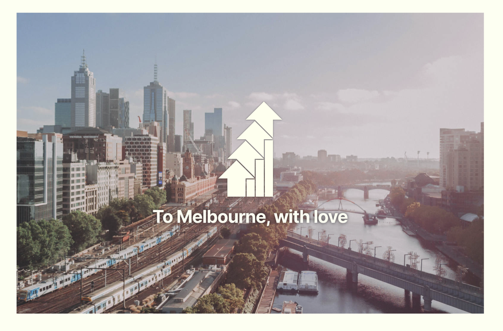

```{r setup, include=FALSE}

knitr::opts_chunk$set(message = FALSE, warning = FALSE, error = FALSE, echo = FALSE, dpi = 300,fig.width = 7, fig.height = 4)

# Corrected function to generate a button with customizable text and link
generateButton <- function(text, link) {
  buttonHTML <- paste0('<div class="button-row"><div style="opacity: 1; transform: translate3d(0px, 0px, 0px) scale3d(1, 1, 1) rotateX(0deg) rotateY(0deg) rotateZ(0deg) skew(0deg); transform-style: preserve-3d;" class="button-wrapper"><a href="', link, '" class="button-fullwidth-2 w-inline-block"><div style="width: 0%; height: 2px;" class="bottom-line-2"></div><div style="height: 0%; width: 2px;" class="left-line-2"></div><div style="width: 0%; height: 2px;" class="top-line-2"></div><div style="height: 0%; width: 2px;" class="right-line-2"></div><div style="height: 0%; width: 538.617px;" class="overlay-colr-button-2"></div><div style="color: rgb(0, 0, 0);" class="button-text">', text, '</div></a></div></div>')
  cat(buttonHTML)
}

lga_html <- paste0("https://yimby-mel.s3.ap-southeast-2.amazonaws.com/",str_replace_all(missing_middle_lgas," ","+"),".html")
# Use the function to generate buttons
knitr::opts_chunk$set(message = FALSE, warning = FALSE, error = FALSE, echo = FALSE, dpi = 300, fig.width = 7, fig.height = 4)

```


Melbourne’s middle urban areas are broadly
underutilised, and the current Governmental
approach of focusing on a small number of activ-
ity centres—while a step in the right direction—
has been slow to roll out, and ignores large
swathes of our urban landscape that would
strongly benefit from enabling medium density.

The answer to the housing supply shortage,
therefore, will not be found in this handful of
designated activity centres and precincts.
Rather, it will be found through the delivery of
permissive planning reforms across every one
of Metropolitan Melbourne’s existing 1,992 train
and tram stops.

Melbourne’s existing rail network provides fre-
quent, high capacity transport options across
the whole city, and by building near these sta-
tions, we give more people access to this net-
work, while simultaneously providing more
destinations that are close to rail.

Through broad transit-oriented upzoning and
development, the Victorian Government can
deliver housing abundance and provide more
housing choices to all current and future resi-
dents across the entirety of the city. This will
fulfil the original goal of Plan Melbourne creat-
ing a vast array of 20-minute neighbourhoods,
rather than a small number of scattered activ-
ity centres.

YIMBY Melbourne's [Missing Middle](https://assets-global.website-files.com/64a530aa67ffbab04c9c39ab/652284ad6a63b8b3ab424966_Missing-Middle-Report.pdf) report recommendeds the introduction
of a new "Missing Middle" Zone which:

1. Implements a default maximum height of
21 metres and 6 storeys, an increase from
the RGZ’s current 4-storey default.
2. Expands non-residential land uses to
include a wider range of neighbourhood
services & amenities.
3. Reduces mandatory parking minimums to 0.
4. Exempts from notice and review develop-
ments of any total value containing at
least 10% public or community housing
in perpetuity.





We want to make Melbourne better. That's why Missing Middle zoning will allow more Melbournians to live near public transport. 

```{r}

dwellings_by_type <- df_mel_props %>%
  group_by(category) %>% 
  summarise(n = n(),
            lot_size = sum(lot_size),
            .groups = "drop") %>% 
  group_by(category) %>% 
  mutate(n_total = sum(n),
         lot_size_total = sum(lot_size))  %>% 
  ungroup() %>%
  mutate(zone_type = "Existing zoning")

dwellings_by_mm_type <- df_mel_props %>%
  group_by(category_new) %>% 
  summarise(n = n(),
            lot_size = sum(lot_size),
            .groups = "drop") %>% 
  group_by(category_new) %>% 
  mutate(n_total = sum(n),
         lot_size_total = sum(lot_size))  %>% 
  ungroup() %>%
  mutate(zone_type = "YIMBY Melbourne Zoning") %>%
  rename(category = category_new)
library(scales)

dwellings_by_type %>% 
  bind_rows(dwellings_by_mm_type) %>% 
  ungroup() %>%
    mutate(category = fct_relevel(category,"Low density residential")) %>% 
  filter(!(category %in% c("Housing not permitted","Civic use makes development less likely","Already developed"))) %>% 
  ggplot(aes(x = category, 
             y = n))+
  coord_flip()+ 
  geom_bar(stat = "identity")+
  theme_yimby_mel_caption(text_size = "small",plot_type = "bar",colour_scale = "light_dark") +
  labs(x = element_blank(),
       title = paste0("Building heights on Melbourne's residential properties"),
       y = "Number of properties",
       fill = "Heritage status") +
  facet_wrap(~zone_type) +
  scale_y_continuous(labels = scales::number_format(scale_cut = cut_short_scale()))

```

#Most councils are not doing enough

With the exception of Melbourne, most middle ring councils in Melbourne are not doing enough to house Melbourne's future population, 
pushing more people out onto our urban fringe. 

```{r fig.height = 8}

pop_change_by_lga <-lga_pop_change_importer(lgas) %>% 
  filter(year == 2022)

pop_change_by_lga %>% 
  mutate(type = if_else(lga_name_2021 == "All of Melbourne","y","n")) %>% 
  ungroup() %>% 
  mutate(change = change - 1, 
         lga_name_2021 = fct_reorder(lga_name_2021,change)) %>% 
  ggplot(aes(x = lga_name_2021, 
             y = change,
             fill = type))+
  geom_bar(stat = "identity")+
  coord_flip()+
  theme_yimby_mel_caption("source: ABS regional populations",text_size = "small")+
  labs(title = "Middle and inner-suburban suburbs are not keeping up with\nMelbourne's need for more housing",
       subtitle = "Population change 2014-2022 (%)",
       y = element_blank(),
       x = element_blank())+
  scale_y_continuous(labels = percent_format(accuracy = 1))+
  theme(legend.position = "none")+
  geom_hline(yintercept = 0)
```


# Housing targets to achieve missing middle

Missing middle zoning will enable Melbourne to achieve it's target of 80,000 new dwellings each year. 
Allowing more people to live near transport will 

# Missing Middle Plans for your area

```{r results='asis'}
cat('<div class="button-row">')
walk2(missing_middle_lgas,lga_html,generateButton)
cat('</div>')


```
