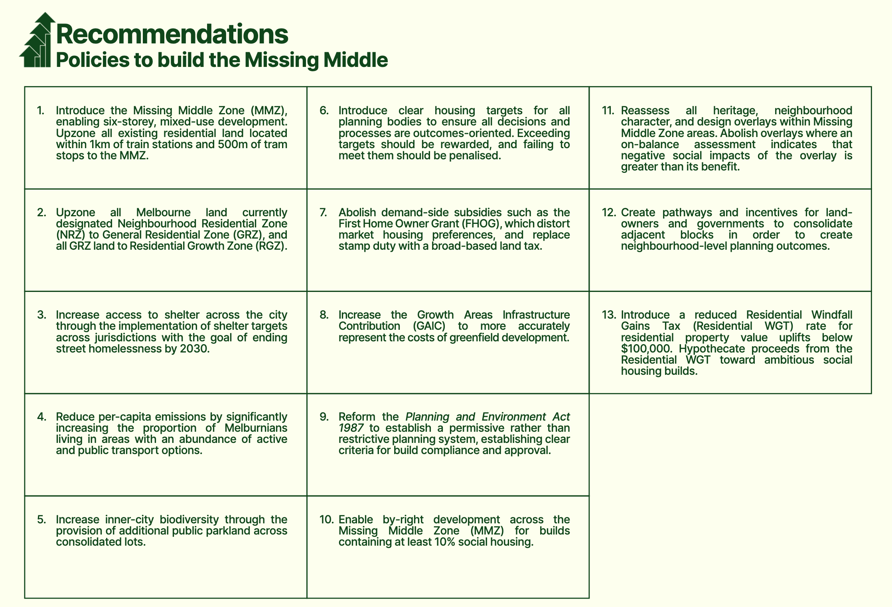

Melbourne's planning system is broken. 

Since Plan Melbourne was introduced, we have relegated our density to a tiny number of "activity centers" on the most polluted, noisy, and dangerous streets. Meanwhile the best blocks of land: on safer streets near parks, schools and public transport are affordable only for the ultra-rich. 

It keeps both developers and NIMBYs happy but it’s inequitable and it's making the city less liveable. 

Melbourne needs gentle-density, with human scaled homes in areas people want to live. Housing should be permitted across all 1,992 of Melbourne's tram stops and train stations, rather than just a few. 

YIMBY Melbourne's Missing Middle zoning will introduce fairer zoning with local targets to create housing abundance.

### A new zone for Melbourne: "Missing Middle"

Missing Middle Zone will enable 6 storey buildings near every train station and tram stop in Melbourne. 
This zone will support European style density, with beautiful street walls without setbacks to activate the street below. 

Buildings in the Missing Middle zone will include neighbourhood services and amenities like cafes and shops on the ground floor. Off-street parking will be allowed, but nobody will be forced to buy a carpark that they don't need. 


### More choice across Melbourne's other residential zones

Not all of Melbourne's suburbs have access to rail but many still benefit from 
nearby schools, hospitals and bus routes. Local communities and businesses that aren’t as
closely situated to Melbourne’s vast train and
tram networks also deserve to reap the benefits
of Melbourne's planning system.

Inspired by the success of Auckland’s zoning reforms, YIMBY Melbourne's reform will completely eliminate
Neighbourhood Residential(NRZ) zones across Metropolitan Melbourne, replacing it with General Residential Zones (GRZ). In turn, all land currently zoned
GRZ will also be upzoned to the Residential Growth Zone (RGZ).


## Fair targets for housing abundance {.tabset}

Where there is considerable demand for more housing in an area, and there is land to enable it, councils should have clear targets to meet their density goals. 

YIMBY Melbourne's housing targets reflect the kind of medium-rise gentle-density that would
make Melbourne a better place to live. 

Each council's target is evidence based. YIMBY Melbourne has allocated Victoria's [56,000 yearly dwelling target in established areas](https://content.vic.gov.au/sites/default/files/2023-09/DTP0424_Housing_Statement_v6_FA_WEB.pdf) to LGAs based on where there is suitably zoned land to build on and where demand for apartment and townhouse living is high. 

These targets are in addition to housing built through greenfield development and rezoning such as in Fisherman's Bend or in the Suburban Rail Loop Precincts. 

### Targets for each Local Government Area

YIMBY Melbourne has calculated fair housing targets for inner and middle Melbourne. 

Targets are highest in places like Boroondara where there are lots of single-family homes on large lots near public transport and strong demand for apartments. 

Targets are lower in areas such as Maribyrnong where apartments sell for much less, making missing middle housing harder to build. 

There are also some areas like Port Phillip where demand is high and yet there simply isn't enough suitable lots of land to build missing middle housing. These Local Government Areas could contribute to housing by rezoning industrial and Commercial areas, which would not be included in our targets until rezoning is complete. 


### Why targets are needed

Except City of Melbourne, every inner and middle ring council is not doing enough to house Melbourne's future population, 
pushing more people out onto our urban fringe. 


Beautifully planned cities like Paris have a built form that 
is predominantly medium-rise and close to public transport,
under a planning
system that enables a high level of site coverage
due to an absence of setback requirements.

The land use patterns seen in Paris — ground
floor commercial and retail spaces, internal
courtyards, and large public enclosed squares
and parks — are largely absent from Melbourne.
There are pockets of this sort of development in
the inner-city, but they are few and far between.

All this is to say: Melbourne’s middle is missing,
because it is broadly banned from being built.

Targets are needed so that councils are free to plan for their local needs, but not in a way that makes the housing crisis worse. 

### How zoning will change

Melbourne's missing middle zoning will focus more housing near public transport where people want to live. 

YIMBY Melbourne has taken existing zoning, and upzoned according to three diffeerent steps:

1. Any lots within lower density residential zones (Including Neighbourhood Residential and General Residential) within 500m of a tram stop or 1km of a train station is rezoned "Missing Middle". This new zone is a refinement of the existing Residential Growth Zone (RGZ),
and has been altered in four key ways. The MMZ:
    1. Implements a default maximum height of 21 metres and 6 storeys, an increase from the RGZ’s current 4-storey default.
    2. Expands non-residential land uses to include a wider range of neighbourhood  services & amenities.
    3. Reduces mandatory parking minimums to 0.
    4. Exempts from notice and review developments of any total value containing at least 10% public or community housing in perpetuity
2. Any lot in a General Residential Zone not near trams or trains is rezoned RGZ, but parking minimums remain unless council states otherwise. 
3. Any lot in a Neighbourhood Residential Zone not near trams or trains is rezoned GRZ, but parking minimums remain unless council states otherwise. 

The effect of these changes will be to upzone much of Melbourne's land, allowing more homes within people's existing communities. 


```{=html}
<div id="kmotogidvl" style="padding-left:0px;padding-right:0px;padding-top:10px;padding-bottom:10px;overflow-x:auto;overflow-y:auto;width:auto;height:auto;">
<style>#kmotogidvl table {
  font-family: system-ui, 'Segoe UI', Roboto, Helvetica, Arial, sans-serif, 'Apple Color Emoji', 'Segoe UI Emoji', 'Segoe UI Symbol', 'Noto Color Emoji';
  -webkit-font-smoothing: antialiased;
  -moz-osx-font-smoothing: grayscale;
}

#kmotogidvl thead, #kmotogidvl tbody, #kmotogidvl tfoot, #kmotogidvl tr, #kmotogidvl td, #kmotogidvl th {
  border-style: none;
}

#kmotogidvl p {
  margin: 0;
  padding: 0;
}

#kmotogidvl .gt_table {
  display: table;
  border-collapse: collapse;
  line-height: normal;
  margin-left: auto;
  margin-right: auto;
  color: #333333;
  font-size: 16px;
  font-weight: normal;
  font-style: normal;
  background-color: #FDFFEE;
  width: auto;
  border-top-style: solid;
  border-top-width: 2px;
  border-top-color: #A8A8A8;
  border-right-style: none;
  border-right-width: 2px;
  border-right-color: #D3D3D3;
  border-bottom-style: solid;
  border-bottom-width: 2px;
  border-bottom-color: #A8A8A8;
  border-left-style: none;
  border-left-width: 2px;
  border-left-color: #D3D3D3;
}

#kmotogidvl .gt_caption {
  padding-top: 4px;
  padding-bottom: 4px;
}

#kmotogidvl .gt_title {
  color: #333333;
  font-size: 125%;
  font-weight: initial;
  padding-top: 4px;
  padding-bottom: 4px;
  padding-left: 5px;
  padding-right: 5px;
  border-bottom-color: #FDFFEE;
  border-bottom-width: 0;
}

#kmotogidvl .gt_subtitle {
  color: #333333;
  font-size: 85%;
  font-weight: initial;
  padding-top: 3px;
  padding-bottom: 5px;
  padding-left: 5px;
  padding-right: 5px;
  border-top-color: #FDFFEE;
  border-top-width: 0;
}

#kmotogidvl .gt_heading {
  background-color: #FDFFEE;
  text-align: center;
  border-bottom-color: #FDFFEE;
  border-left-style: none;
  border-left-width: 1px;
  border-left-color: #D3D3D3;
  border-right-style: none;
  border-right-width: 1px;
  border-right-color: #D3D3D3;
}

#kmotogidvl .gt_bottom_border {
  border-bottom-style: solid;
  border-bottom-width: 2px;
  border-bottom-color: #D3D3D3;
}

#kmotogidvl .gt_col_headings {
  border-top-style: solid;
  border-top-width: 2px;
  border-top-color: #D3D3D3;
  border-bottom-style: solid;
  border-bottom-width: 2px;
  border-bottom-color: #D3D3D3;
  border-left-style: none;
  border-left-width: 1px;
  border-left-color: #D3D3D3;
  border-right-style: none;
  border-right-width: 1px;
  border-right-color: #D3D3D3;
}

#kmotogidvl .gt_col_heading {
  color: #333333;
  background-color: #FDFFEE;
  font-size: 100%;
  font-weight: normal;
  text-transform: inherit;
  border-left-style: none;
  border-left-width: 1px;
  border-left-color: #D3D3D3;
  border-right-style: none;
  border-right-width: 1px;
  border-right-color: #D3D3D3;
  vertical-align: bottom;
  padding-top: 5px;
  padding-bottom: 6px;
  padding-left: 5px;
  padding-right: 5px;
  overflow-x: hidden;
}

#kmotogidvl .gt_column_spanner_outer {
  color: #333333;
  background-color: #FDFFEE;
  font-size: 100%;
  font-weight: normal;
  text-transform: inherit;
  padding-top: 0;
  padding-bottom: 0;
  padding-left: 4px;
  padding-right: 4px;
}

#kmotogidvl .gt_column_spanner_outer:first-child {
  padding-left: 0;
}

#kmotogidvl .gt_column_spanner_outer:last-child {
  padding-right: 0;
}

#kmotogidvl .gt_column_spanner {
  border-bottom-style: solid;
  border-bottom-width: 2px;
  border-bottom-color: #D3D3D3;
  vertical-align: bottom;
  padding-top: 5px;
  padding-bottom: 5px;
  overflow-x: hidden;
  display: inline-block;
  width: 100%;
}

#kmotogidvl .gt_spanner_row {
  border-bottom-style: hidden;
}

#kmotogidvl .gt_group_heading {
  padding-top: 8px;
  padding-bottom: 8px;
  padding-left: 5px;
  padding-right: 5px;
  color: #333333;
  background-color: #FDFFEE;
  font-size: 100%;
  font-weight: initial;
  text-transform: inherit;
  border-top-style: solid;
  border-top-width: 2px;
  border-top-color: #D3D3D3;
  border-bottom-style: solid;
  border-bottom-width: 2px;
  border-bottom-color: #D3D3D3;
  border-left-style: none;
  border-left-width: 1px;
  border-left-color: #D3D3D3;
  border-right-style: none;
  border-right-width: 1px;
  border-right-color: #D3D3D3;
  vertical-align: middle;
  text-align: left;
}

#kmotogidvl .gt_empty_group_heading {
  padding: 0.5px;
  color: #333333;
  background-color: #FDFFEE;
  font-size: 100%;
  font-weight: initial;
  border-top-style: solid;
  border-top-width: 2px;
  border-top-color: #D3D3D3;
  border-bottom-style: solid;
  border-bottom-width: 2px;
  border-bottom-color: #D3D3D3;
  vertical-align: middle;
}

#kmotogidvl .gt_from_md > :first-child {
  margin-top: 0;
}

#kmotogidvl .gt_from_md > :last-child {
  margin-bottom: 0;
}

#kmotogidvl .gt_row {
  padding-top: 8px;
  padding-bottom: 8px;
  padding-left: 5px;
  padding-right: 5px;
  margin: 10px;
  border-top-style: solid;
  border-top-width: 1px;
  border-top-color: #D3D3D3;
  border-left-style: none;
  border-left-width: 1px;
  border-left-color: #D3D3D3;
  border-right-style: none;
  border-right-width: 1px;
  border-right-color: #D3D3D3;
  vertical-align: middle;
  overflow-x: hidden;
}

#kmotogidvl .gt_stub {
  color: #333333;
  background-color: #FDFFEE;
  font-size: 100%;
  font-weight: initial;
  text-transform: inherit;
  border-right-style: solid;
  border-right-width: 2px;
  border-right-color: #D3D3D3;
  padding-left: 5px;
  padding-right: 5px;
}

#kmotogidvl .gt_stub_row_group {
  color: #333333;
  background-color: #FDFFEE;
  font-size: 100%;
  font-weight: initial;
  text-transform: inherit;
  border-right-style: solid;
  border-right-width: 2px;
  border-right-color: #D3D3D3;
  padding-left: 5px;
  padding-right: 5px;
  vertical-align: top;
}

#kmotogidvl .gt_row_group_first td {
  border-top-width: 2px;
}

#kmotogidvl .gt_row_group_first th {
  border-top-width: 2px;
}

#kmotogidvl .gt_summary_row {
  color: #333333;
  background-color: #FDFFEE;
  text-transform: inherit;
  padding-top: 8px;
  padding-bottom: 8px;
  padding-left: 5px;
  padding-right: 5px;
}

#kmotogidvl .gt_first_summary_row {
  border-top-style: solid;
  border-top-color: #D3D3D3;
}

#kmotogidvl .gt_first_summary_row.thick {
  border-top-width: 2px;
}

#kmotogidvl .gt_last_summary_row {
  padding-top: 8px;
  padding-bottom: 8px;
  padding-left: 5px;
  padding-right: 5px;
  border-bottom-style: solid;
  border-bottom-width: 2px;
  border-bottom-color: #D3D3D3;
}

#kmotogidvl .gt_grand_summary_row {
  color: #333333;
  background-color: #FDFFEE;
  text-transform: inherit;
  padding-top: 8px;
  padding-bottom: 8px;
  padding-left: 5px;
  padding-right: 5px;
}

#kmotogidvl .gt_first_grand_summary_row {
  padding-top: 8px;
  padding-bottom: 8px;
  padding-left: 5px;
  padding-right: 5px;
  border-top-style: double;
  border-top-width: 6px;
  border-top-color: #D3D3D3;
}

#kmotogidvl .gt_last_grand_summary_row_top {
  padding-top: 8px;
  padding-bottom: 8px;
  padding-left: 5px;
  padding-right: 5px;
  border-bottom-style: double;
  border-bottom-width: 6px;
  border-bottom-color: #D3D3D3;
}

#kmotogidvl .gt_striped {
  background-color: rgba(128, 128, 128, 0.05);
}

#kmotogidvl .gt_table_body {
  border-top-style: solid;
  border-top-width: 2px;
  border-top-color: #D3D3D3;
  border-bottom-style: solid;
  border-bottom-width: 2px;
  border-bottom-color: #D3D3D3;
}

#kmotogidvl .gt_footnotes {
  color: #333333;
  background-color: #FDFFEE;
  border-bottom-style: none;
  border-bottom-width: 2px;
  border-bottom-color: #D3D3D3;
  border-left-style: none;
  border-left-width: 2px;
  border-left-color: #D3D3D3;
  border-right-style: none;
  border-right-width: 2px;
  border-right-color: #D3D3D3;
}

#kmotogidvl .gt_footnote {
  margin: 0px;
  font-size: 90%;
  padding-top: 4px;
  padding-bottom: 4px;
  padding-left: 5px;
  padding-right: 5px;
}

#kmotogidvl .gt_sourcenotes {
  color: #333333;
  background-color: #FDFFEE;
  border-bottom-style: none;
  border-bottom-width: 2px;
  border-bottom-color: #D3D3D3;
  border-left-style: none;
  border-left-width: 2px;
  border-left-color: #D3D3D3;
  border-right-style: none;
  border-right-width: 2px;
  border-right-color: #D3D3D3;
}

#kmotogidvl .gt_sourcenote {
  font-size: 90%;
  padding-top: 4px;
  padding-bottom: 4px;
  padding-left: 5px;
  padding-right: 5px;
}

#kmotogidvl .gt_left {
  text-align: left;
}

#kmotogidvl .gt_center {
  text-align: center;
}

#kmotogidvl .gt_right {
  text-align: right;
  font-variant-numeric: tabular-nums;
}

#kmotogidvl .gt_font_normal {
  font-weight: normal;
}

#kmotogidvl .gt_font_bold {
  font-weight: bold;
}

#kmotogidvl .gt_font_italic {
  font-style: italic;
}

#kmotogidvl .gt_super {
  font-size: 65%;
}

#kmotogidvl .gt_footnote_marks {
  font-size: 75%;
  vertical-align: 0.4em;
  position: initial;
}

#kmotogidvl .gt_asterisk {
  font-size: 100%;
  vertical-align: 0;
}

#kmotogidvl .gt_indent_1 {
  text-indent: 5px;
}

#kmotogidvl .gt_indent_2 {
  text-indent: 10px;
}

#kmotogidvl .gt_indent_3 {
  text-indent: 15px;
}

#kmotogidvl .gt_indent_4 {
  text-indent: 20px;
}

#kmotogidvl .gt_indent_5 {
  text-indent: 25px;
}
</style>
<table class="gt_table" data-quarto-disable-processing="false" data-quarto-bootstrap="false">
  <thead>
    <tr class="gt_col_headings">
      <th class="gt_col_heading gt_columns_bottom_border gt_left" rowspan="1" colspan="1" scope="col" id=" "> </th>
      <th class="gt_col_heading gt_columns_bottom_border gt_right" rowspan="1" colspan="1" scope="col" id="Current zoned capacity">Current zoned capacity</th>
      <th class="gt_col_heading gt_columns_bottom_border gt_right" rowspan="1" colspan="1" scope="col" id="New zoned capacity under Missing Middle">New zoned capacity under Missing Middle</th>
      <th class="gt_col_heading gt_columns_bottom_border gt_left" rowspan="1" colspan="1" scope="col" id="Increase in zoned capacity">Increase in zoned capacity</th>
    </tr>
  </thead>
  <tbody class="gt_table_body">
    <tr><td headers=" " class="gt_row gt_left">Boroondara</td>
<td headers="Current zoned capacity" class="gt_row gt_right">57,500</td>
<td headers="New zoned capacity under Missing Middle" class="gt_row gt_right">923,000</td>
<td headers="Increase in zoned capacity" class="gt_row gt_left">16x</td></tr>
    <tr><td headers=" " class="gt_row gt_left">Glen Eira</td>
<td headers="Current zoned capacity" class="gt_row gt_right">49,600</td>
<td headers="New zoned capacity under Missing Middle" class="gt_row gt_right">560,000</td>
<td headers="Increase in zoned capacity" class="gt_row gt_left">11.3x</td></tr>
    <tr><td headers=" " class="gt_row gt_left">Bayside</td>
<td headers="Current zoned capacity" class="gt_row gt_right">38,200</td>
<td headers="New zoned capacity under Missing Middle" class="gt_row gt_right">387,000</td>
<td headers="Increase in zoned capacity" class="gt_row gt_left">10.1x</td></tr>
    <tr><td headers=" " class="gt_row gt_left">Hobsons Bay</td>
<td headers="Current zoned capacity" class="gt_row gt_right">35,100</td>
<td headers="New zoned capacity under Missing Middle" class="gt_row gt_right">338,000</td>
<td headers="Increase in zoned capacity" class="gt_row gt_left">9.6x</td></tr>
    <tr><td headers=" " class="gt_row gt_left">Banyule</td>
<td headers="Current zoned capacity" class="gt_row gt_right">78,100</td>
<td headers="New zoned capacity under Missing Middle" class="gt_row gt_right">745,000</td>
<td headers="Increase in zoned capacity" class="gt_row gt_left">9.5x</td></tr>
    <tr><td headers=" " class="gt_row gt_left">Kingston</td>
<td headers="Current zoned capacity" class="gt_row gt_right">98,500</td>
<td headers="New zoned capacity under Missing Middle" class="gt_row gt_right">871,000</td>
<td headers="Increase in zoned capacity" class="gt_row gt_left">8.8x</td></tr>
    <tr><td headers=" " class="gt_row gt_left">Maroondah</td>
<td headers="Current zoned capacity" class="gt_row gt_right">78,700</td>
<td headers="New zoned capacity under Missing Middle" class="gt_row gt_right">655,000</td>
<td headers="Increase in zoned capacity" class="gt_row gt_left">8.3x</td></tr>
    <tr><td headers=" " class="gt_row gt_left">Monash</td>
<td headers="Current zoned capacity" class="gt_row gt_right">109,000</td>
<td headers="New zoned capacity under Missing Middle" class="gt_row gt_right">875,000</td>
<td headers="Increase in zoned capacity" class="gt_row gt_left">8x</td></tr>
    <tr><td headers=" " class="gt_row gt_left">Whitehorse</td>
<td headers="Current zoned capacity" class="gt_row gt_right">97,300</td>
<td headers="New zoned capacity under Missing Middle" class="gt_row gt_right">775,000</td>
<td headers="Increase in zoned capacity" class="gt_row gt_left">8x</td></tr>
    <tr><td headers=" " class="gt_row gt_left">Moonee Valley</td>
<td headers="Current zoned capacity" class="gt_row gt_right">80,900</td>
<td headers="New zoned capacity under Missing Middle" class="gt_row gt_right">630,000</td>
<td headers="Increase in zoned capacity" class="gt_row gt_left">7.8x</td></tr>
    <tr><td headers=" " class="gt_row gt_left">Merri-bek</td>
<td headers="Current zoned capacity" class="gt_row gt_right">87,400</td>
<td headers="New zoned capacity under Missing Middle" class="gt_row gt_right">675,000</td>
<td headers="Increase in zoned capacity" class="gt_row gt_left">7.7x</td></tr>
    <tr><td headers=" " class="gt_row gt_left">Darebin</td>
<td headers="Current zoned capacity" class="gt_row gt_right">104,000</td>
<td headers="New zoned capacity under Missing Middle" class="gt_row gt_right">765,000</td>
<td headers="Increase in zoned capacity" class="gt_row gt_left">7.3x</td></tr>
    <tr><td headers=" " class="gt_row gt_left">Stonnington</td>
<td headers="Current zoned capacity" class="gt_row gt_right">78,800</td>
<td headers="New zoned capacity under Missing Middle" class="gt_row gt_right">537,000</td>
<td headers="Increase in zoned capacity" class="gt_row gt_left">6.8x</td></tr>
    <tr><td headers=" " class="gt_row gt_left">Brimbank</td>
<td headers="Current zoned capacity" class="gt_row gt_right">106,000</td>
<td headers="New zoned capacity under Missing Middle" class="gt_row gt_right">663,000</td>
<td headers="Increase in zoned capacity" class="gt_row gt_left">6.3x</td></tr>
    <tr><td headers=" " class="gt_row gt_left">Manningham</td>
<td headers="Current zoned capacity" class="gt_row gt_right">93,700</td>
<td headers="New zoned capacity under Missing Middle" class="gt_row gt_right">574,000</td>
<td headers="Increase in zoned capacity" class="gt_row gt_left">6.1x</td></tr>
    <tr><td headers=" " class="gt_row gt_left">Maribyrnong</td>
<td headers="Current zoned capacity" class="gt_row gt_right">70,900</td>
<td headers="New zoned capacity under Missing Middle" class="gt_row gt_right">416,000</td>
<td headers="Increase in zoned capacity" class="gt_row gt_left">5.9x</td></tr>
    <tr><td headers=" " class="gt_row gt_left">Port Phillip</td>
<td headers="Current zoned capacity" class="gt_row gt_right">64,000</td>
<td headers="New zoned capacity under Missing Middle" class="gt_row gt_right">349,000</td>
<td headers="Increase in zoned capacity" class="gt_row gt_left">5.5x</td></tr>
    <tr><td headers=" " class="gt_row gt_left">Yarra</td>
<td headers="Current zoned capacity" class="gt_row gt_right">59,900</td>
<td headers="New zoned capacity under Missing Middle" class="gt_row gt_right">291,000</td>
<td headers="Increase in zoned capacity" class="gt_row gt_left">4.9x</td></tr>
    <tr><td headers=" " class="gt_row gt_left">Melbourne</td>
<td headers="Current zoned capacity" class="gt_row gt_right">84,000</td>
<td headers="New zoned capacity under Missing Middle" class="gt_row gt_right">296,000</td>
<td headers="Increase in zoned capacity" class="gt_row gt_left">3.5x</td></tr>
    <tr><td headers=" " class="gt_row gt_left" style="font-weight: bold;">Total</td>
<td headers="Current zoned capacity" class="gt_row gt_right" style="font-weight: bold;">1,470,000</td>
<td headers="New zoned capacity under Missing Middle" class="gt_row gt_right" style="font-weight: bold;">11,300,000</td>
<td headers="Increase in zoned capacity" class="gt_row gt_left" style="font-weight: bold;">7.7x</td></tr>
  </tbody>
  
  
</table>
</div>
```

A detailed map of each Local Council's rezoning has been provided on the Local Council pages below. 

### Details on the targets

There is no use having a housing target if there is no land to build on, 
or if there is nobody who wants to live in these new homes. 

It's common for planners to calculate "Zoned Capacity" which is the theoretical number of homes that could be built on a site if every lot was built to maximum zoning. 

But its incredibly unlikely this would ever happen, as in many cases it might be technically possible to increase density on a piece of land but not financially viable.

YIMBY Melbourne has therefore carefully calculated not just the new zoned capacity under Missing Middle, but also where 
there is enough demand to make development pracitical as well. We have used a precise 7 stage methodology: 

1) Sites that are parks, schools, hospitals or already have apartments are considered ineligible for any Missing Middle housing
2) Any lot zoned "Missing Middle" is considered suitable for 6 storeys of housing with high lot coverage. The potential yield of these properties is calcualted based on the yield achieved by 6 storey Nightingdale developments in Melbourne.
3) Potential yield for RGZ, GRZ, and NRZ lots is based on the density calculated by [Professor Michael Buxton](https://cur.org.au/project/melbourne-8-million-matching-land-supply-dwelling-demand/).
4) For each lot, the cost of demolishing the existing home and building 85 square meter GFA apartments in its place was calcualted. Taller buildings were more expensive to construct owing to increased structural requirements. Because RGZ lots have car parking requirements, the cost of an undeground car park was added to construction costs for lots within this zone. The full formula is available [here](https://github.com/yimbymelbourne/missing_middle_2/blob/main/R/functions/find%20profitable_apartments_for_zoning_targets.R). 
5) The value of existing properties was calculated using a regression of past house sale prices against features of the land such as current zone, lot size, distance from CBD, SA3, and distance from public transport. The full regression terms are available [here](https://github.com/yimbymelbourne/missing_middle_2/blob/main/R/R_regressions/03run_regression.R). 
6) The likely price of apartments sold in a development on that lot was calculated using a similar regression as above. 
7) For each site, the profitability of a development was calculated at various heights within Missing Middle zoning. Each site were profit is greater than 0 contributes to that state's housing targets. 

Development isn't expected to occur on every viable site, but councils who have more viable sites will have a higher share of the state's housing target.  

Heritage overlays over large swathes of our inner-suburbs should not be an excuse for councils to miss their housing targets. Councils with considerable heritage in missing middle zones will need to consider how to best achieve their targets whilst maintaining heritage in a way that is most important to them. 

Councils should be given the ability to re-evaluate heritage overlays and Design and Development overlays if they are unable to meet housing targets within current overlays. And they should also be able to apply for higher density if high-value heritage is preventing them from reaching their targets.  

The best way for a Local Government Area to reduce its target is to make housing cheaper. 
Melbourne's Missing Middle targets should be updated by government every year, 
and if apartment prices
fall relative to other areas, then the housing target will automatically fall as it will become clear that development is no longer profitable in that area.


```{=html}
<div id="ajmrzyjluy" style="padding-left:0px;padding-right:0px;padding-top:10px;padding-bottom:10px;overflow-x:auto;overflow-y:auto;width:auto;height:auto;">
<style>#ajmrzyjluy table {
  font-family: system-ui, 'Segoe UI', Roboto, Helvetica, Arial, sans-serif, 'Apple Color Emoji', 'Segoe UI Emoji', 'Segoe UI Symbol', 'Noto Color Emoji';
  -webkit-font-smoothing: antialiased;
  -moz-osx-font-smoothing: grayscale;
}

#ajmrzyjluy thead, #ajmrzyjluy tbody, #ajmrzyjluy tfoot, #ajmrzyjluy tr, #ajmrzyjluy td, #ajmrzyjluy th {
  border-style: none;
}

#ajmrzyjluy p {
  margin: 0;
  padding: 0;
}

#ajmrzyjluy .gt_table {
  display: table;
  border-collapse: collapse;
  line-height: normal;
  margin-left: auto;
  margin-right: auto;
  color: #333333;
  font-size: 16px;
  font-weight: normal;
  font-style: normal;
  background-color: #FDFFEE;
  width: auto;
  border-top-style: solid;
  border-top-width: 2px;
  border-top-color: #A8A8A8;
  border-right-style: none;
  border-right-width: 2px;
  border-right-color: #D3D3D3;
  border-bottom-style: solid;
  border-bottom-width: 2px;
  border-bottom-color: #A8A8A8;
  border-left-style: none;
  border-left-width: 2px;
  border-left-color: #D3D3D3;
}

#ajmrzyjluy .gt_caption {
  padding-top: 4px;
  padding-bottom: 4px;
}

#ajmrzyjluy .gt_title {
  color: #333333;
  font-size: 125%;
  font-weight: initial;
  padding-top: 4px;
  padding-bottom: 4px;
  padding-left: 5px;
  padding-right: 5px;
  border-bottom-color: #FDFFEE;
  border-bottom-width: 0;
}

#ajmrzyjluy .gt_subtitle {
  color: #333333;
  font-size: 85%;
  font-weight: initial;
  padding-top: 3px;
  padding-bottom: 5px;
  padding-left: 5px;
  padding-right: 5px;
  border-top-color: #FDFFEE;
  border-top-width: 0;
}

#ajmrzyjluy .gt_heading {
  background-color: #FDFFEE;
  text-align: center;
  border-bottom-color: #FDFFEE;
  border-left-style: none;
  border-left-width: 1px;
  border-left-color: #D3D3D3;
  border-right-style: none;
  border-right-width: 1px;
  border-right-color: #D3D3D3;
}

#ajmrzyjluy .gt_bottom_border {
  border-bottom-style: solid;
  border-bottom-width: 2px;
  border-bottom-color: #D3D3D3;
}

#ajmrzyjluy .gt_col_headings {
  border-top-style: solid;
  border-top-width: 2px;
  border-top-color: #D3D3D3;
  border-bottom-style: solid;
  border-bottom-width: 2px;
  border-bottom-color: #D3D3D3;
  border-left-style: none;
  border-left-width: 1px;
  border-left-color: #D3D3D3;
  border-right-style: none;
  border-right-width: 1px;
  border-right-color: #D3D3D3;
}

#ajmrzyjluy .gt_col_heading {
  color: #333333;
  background-color: #FDFFEE;
  font-size: 100%;
  font-weight: normal;
  text-transform: inherit;
  border-left-style: none;
  border-left-width: 1px;
  border-left-color: #D3D3D3;
  border-right-style: none;
  border-right-width: 1px;
  border-right-color: #D3D3D3;
  vertical-align: bottom;
  padding-top: 5px;
  padding-bottom: 6px;
  padding-left: 5px;
  padding-right: 5px;
  overflow-x: hidden;
}

#ajmrzyjluy .gt_column_spanner_outer {
  color: #333333;
  background-color: #FDFFEE;
  font-size: 100%;
  font-weight: normal;
  text-transform: inherit;
  padding-top: 0;
  padding-bottom: 0;
  padding-left: 4px;
  padding-right: 4px;
}

#ajmrzyjluy .gt_column_spanner_outer:first-child {
  padding-left: 0;
}

#ajmrzyjluy .gt_column_spanner_outer:last-child {
  padding-right: 0;
}

#ajmrzyjluy .gt_column_spanner {
  border-bottom-style: solid;
  border-bottom-width: 2px;
  border-bottom-color: #D3D3D3;
  vertical-align: bottom;
  padding-top: 5px;
  padding-bottom: 5px;
  overflow-x: hidden;
  display: inline-block;
  width: 100%;
}

#ajmrzyjluy .gt_spanner_row {
  border-bottom-style: hidden;
}

#ajmrzyjluy .gt_group_heading {
  padding-top: 8px;
  padding-bottom: 8px;
  padding-left: 5px;
  padding-right: 5px;
  color: #333333;
  background-color: #FDFFEE;
  font-size: 100%;
  font-weight: initial;
  text-transform: inherit;
  border-top-style: solid;
  border-top-width: 2px;
  border-top-color: #D3D3D3;
  border-bottom-style: solid;
  border-bottom-width: 2px;
  border-bottom-color: #D3D3D3;
  border-left-style: none;
  border-left-width: 1px;
  border-left-color: #D3D3D3;
  border-right-style: none;
  border-right-width: 1px;
  border-right-color: #D3D3D3;
  vertical-align: middle;
  text-align: left;
}

#ajmrzyjluy .gt_empty_group_heading {
  padding: 0.5px;
  color: #333333;
  background-color: #FDFFEE;
  font-size: 100%;
  font-weight: initial;
  border-top-style: solid;
  border-top-width: 2px;
  border-top-color: #D3D3D3;
  border-bottom-style: solid;
  border-bottom-width: 2px;
  border-bottom-color: #D3D3D3;
  vertical-align: middle;
}

#ajmrzyjluy .gt_from_md > :first-child {
  margin-top: 0;
}

#ajmrzyjluy .gt_from_md > :last-child {
  margin-bottom: 0;
}

#ajmrzyjluy .gt_row {
  padding-top: 8px;
  padding-bottom: 8px;
  padding-left: 5px;
  padding-right: 5px;
  margin: 10px;
  border-top-style: solid;
  border-top-width: 1px;
  border-top-color: #D3D3D3;
  border-left-style: none;
  border-left-width: 1px;
  border-left-color: #D3D3D3;
  border-right-style: none;
  border-right-width: 1px;
  border-right-color: #D3D3D3;
  vertical-align: middle;
  overflow-x: hidden;
}

#ajmrzyjluy .gt_stub {
  color: #333333;
  background-color: #FDFFEE;
  font-size: 100%;
  font-weight: initial;
  text-transform: inherit;
  border-right-style: solid;
  border-right-width: 2px;
  border-right-color: #D3D3D3;
  padding-left: 5px;
  padding-right: 5px;
}

#ajmrzyjluy .gt_stub_row_group {
  color: #333333;
  background-color: #FDFFEE;
  font-size: 100%;
  font-weight: initial;
  text-transform: inherit;
  border-right-style: solid;
  border-right-width: 2px;
  border-right-color: #D3D3D3;
  padding-left: 5px;
  padding-right: 5px;
  vertical-align: top;
}

#ajmrzyjluy .gt_row_group_first td {
  border-top-width: 2px;
}

#ajmrzyjluy .gt_row_group_first th {
  border-top-width: 2px;
}

#ajmrzyjluy .gt_summary_row {
  color: #333333;
  background-color: #FDFFEE;
  text-transform: inherit;
  padding-top: 8px;
  padding-bottom: 8px;
  padding-left: 5px;
  padding-right: 5px;
}

#ajmrzyjluy .gt_first_summary_row {
  border-top-style: solid;
  border-top-color: #D3D3D3;
}

#ajmrzyjluy .gt_first_summary_row.thick {
  border-top-width: 2px;
}

#ajmrzyjluy .gt_last_summary_row {
  padding-top: 8px;
  padding-bottom: 8px;
  padding-left: 5px;
  padding-right: 5px;
  border-bottom-style: solid;
  border-bottom-width: 2px;
  border-bottom-color: #D3D3D3;
}

#ajmrzyjluy .gt_grand_summary_row {
  color: #333333;
  background-color: #FDFFEE;
  text-transform: inherit;
  padding-top: 8px;
  padding-bottom: 8px;
  padding-left: 5px;
  padding-right: 5px;
}

#ajmrzyjluy .gt_first_grand_summary_row {
  padding-top: 8px;
  padding-bottom: 8px;
  padding-left: 5px;
  padding-right: 5px;
  border-top-style: double;
  border-top-width: 6px;
  border-top-color: #D3D3D3;
}

#ajmrzyjluy .gt_last_grand_summary_row_top {
  padding-top: 8px;
  padding-bottom: 8px;
  padding-left: 5px;
  padding-right: 5px;
  border-bottom-style: double;
  border-bottom-width: 6px;
  border-bottom-color: #D3D3D3;
}

#ajmrzyjluy .gt_striped {
  background-color: rgba(128, 128, 128, 0.05);
}

#ajmrzyjluy .gt_table_body {
  border-top-style: solid;
  border-top-width: 2px;
  border-top-color: #D3D3D3;
  border-bottom-style: solid;
  border-bottom-width: 2px;
  border-bottom-color: #D3D3D3;
}

#ajmrzyjluy .gt_footnotes {
  color: #333333;
  background-color: #FDFFEE;
  border-bottom-style: none;
  border-bottom-width: 2px;
  border-bottom-color: #D3D3D3;
  border-left-style: none;
  border-left-width: 2px;
  border-left-color: #D3D3D3;
  border-right-style: none;
  border-right-width: 2px;
  border-right-color: #D3D3D3;
}

#ajmrzyjluy .gt_footnote {
  margin: 0px;
  font-size: 90%;
  padding-top: 4px;
  padding-bottom: 4px;
  padding-left: 5px;
  padding-right: 5px;
}

#ajmrzyjluy .gt_sourcenotes {
  color: #333333;
  background-color: #FDFFEE;
  border-bottom-style: none;
  border-bottom-width: 2px;
  border-bottom-color: #D3D3D3;
  border-left-style: none;
  border-left-width: 2px;
  border-left-color: #D3D3D3;
  border-right-style: none;
  border-right-width: 2px;
  border-right-color: #D3D3D3;
}

#ajmrzyjluy .gt_sourcenote {
  font-size: 90%;
  padding-top: 4px;
  padding-bottom: 4px;
  padding-left: 5px;
  padding-right: 5px;
}

#ajmrzyjluy .gt_left {
  text-align: left;
}

#ajmrzyjluy .gt_center {
  text-align: center;
}

#ajmrzyjluy .gt_right {
  text-align: right;
  font-variant-numeric: tabular-nums;
}

#ajmrzyjluy .gt_font_normal {
  font-weight: normal;
}

#ajmrzyjluy .gt_font_bold {
  font-weight: bold;
}

#ajmrzyjluy .gt_font_italic {
  font-style: italic;
}

#ajmrzyjluy .gt_super {
  font-size: 65%;
}

#ajmrzyjluy .gt_footnote_marks {
  font-size: 75%;
  vertical-align: 0.4em;
  position: initial;
}

#ajmrzyjluy .gt_asterisk {
  font-size: 100%;
  vertical-align: 0;
}

#ajmrzyjluy .gt_indent_1 {
  text-indent: 5px;
}

#ajmrzyjluy .gt_indent_2 {
  text-indent: 10px;
}

#ajmrzyjluy .gt_indent_3 {
  text-indent: 15px;
}

#ajmrzyjluy .gt_indent_4 {
  text-indent: 20px;
}

#ajmrzyjluy .gt_indent_5 {
  text-indent: 25px;
}
</style>
<table class="gt_table" data-quarto-disable-processing="false" data-quarto-bootstrap="false">
  <thead>
    <tr class="gt_col_headings">
      <th class="gt_col_heading gt_columns_bottom_border gt_left" rowspan="1" colspan="1" scope="col" id=" "> </th>
      <th class="gt_col_heading gt_columns_bottom_border gt_right" rowspan="1" colspan="1" scope="col" id="New zoned capacity where development is viable">New zoned capacity where development is viable</th>
      <th class="gt_col_heading gt_columns_bottom_border gt_right" rowspan="1" colspan="1" scope="col" id="Yearly new home target">Yearly new home target</th>
      <th class="gt_col_heading gt_columns_bottom_border gt_right" rowspan="1" colspan="1" scope="col" id="Local target as a share of city-wide target">Local target as a share of city-wide target</th>
      <th class="gt_col_heading gt_columns_bottom_border gt_right" rowspan="1" colspan="1" scope="col" id="Local target relative to other LGAs (scaled to existing population)">Local target relative to other LGAs (scaled to existing population)</th>
    </tr>
  </thead>
  <tbody class="gt_table_body">
    <tr><td headers=" " class="gt_row gt_left">Boroondara</td>
<td headers="New zoned capacity where development is viable" class="gt_row gt_right">836,000</td>
<td headers="Yearly new home target" class="gt_row gt_right">6,850</td>
<td headers="Local target as a share of city-wide target" class="gt_row gt_right">12.2%</td>
<td headers="Local target relative to other LGAs (scaled to existing population)" class="gt_row gt_right">197%</td></tr>
    <tr><td headers=" " class="gt_row gt_left">Banyule</td>
<td headers="New zoned capacity where development is viable" class="gt_row gt_right">564,000</td>
<td headers="Yearly new home target" class="gt_row gt_right">4,640</td>
<td headers="Local target as a share of city-wide target" class="gt_row gt_right">8.3%</td>
<td headers="Local target relative to other LGAs (scaled to existing population)" class="gt_row gt_right">184%</td></tr>
    <tr><td headers=" " class="gt_row gt_left">Bayside</td>
<td headers="New zoned capacity where development is viable" class="gt_row gt_right">338,000</td>
<td headers="Yearly new home target" class="gt_row gt_right">2,790</td>
<td headers="Local target as a share of city-wide target" class="gt_row gt_right">5.0%</td>
<td headers="Local target relative to other LGAs (scaled to existing population)" class="gt_row gt_right">140%</td></tr>
    <tr><td headers=" " class="gt_row gt_left">Manningham</td>
<td headers="New zoned capacity where development is viable" class="gt_row gt_right">389,000</td>
<td headers="Yearly new home target" class="gt_row gt_right">3,230</td>
<td headers="Local target as a share of city-wide target" class="gt_row gt_right">5.8%</td>
<td headers="Local target relative to other LGAs (scaled to existing population)" class="gt_row gt_right">140%</td></tr>
    <tr><td headers=" " class="gt_row gt_left">Stonnington</td>
<td headers="New zoned capacity where development is viable" class="gt_row gt_right">459,000</td>
<td headers="Yearly new home target" class="gt_row gt_right">3,780</td>
<td headers="Local target as a share of city-wide target" class="gt_row gt_right">6.8%</td>
<td headers="Local target relative to other LGAs (scaled to existing population)" class="gt_row gt_right">134%</td></tr>
    <tr><td headers=" " class="gt_row gt_left">Moonee Valley</td>
<td headers="New zoned capacity where development is viable" class="gt_row gt_right">420,000</td>
<td headers="Yearly new home target" class="gt_row gt_right">3,480</td>
<td headers="Local target as a share of city-wide target" class="gt_row gt_right">6.2%</td>
<td headers="Local target relative to other LGAs (scaled to existing population)" class="gt_row gt_right">132%</td></tr>
    <tr><td headers=" " class="gt_row gt_left">Glen Eira</td>
<td headers="New zoned capacity where development is viable" class="gt_row gt_right">469,000</td>
<td headers="Yearly new home target" class="gt_row gt_right">3,880</td>
<td headers="Local target as a share of city-wide target" class="gt_row gt_right">6.9%</td>
<td headers="Local target relative to other LGAs (scaled to existing population)" class="gt_row gt_right">125%</td></tr>
    <tr><td headers=" " class="gt_row gt_left">Whitehorse</td>
<td headers="New zoned capacity where development is viable" class="gt_row gt_right">521,000</td>
<td headers="Yearly new home target" class="gt_row gt_right">4,270</td>
<td headers="Local target as a share of city-wide target" class="gt_row gt_right">7.6%</td>
<td headers="Local target relative to other LGAs (scaled to existing population)" class="gt_row gt_right">125%</td></tr>
    <tr><td headers=" " class="gt_row gt_left">Darebin</td>
<td headers="New zoned capacity where development is viable" class="gt_row gt_right">455,000</td>
<td headers="Yearly new home target" class="gt_row gt_right">3,760</td>
<td headers="Local target as a share of city-wide target" class="gt_row gt_right">6.7%</td>
<td headers="Local target relative to other LGAs (scaled to existing population)" class="gt_row gt_right">120%</td></tr>
    <tr><td headers=" " class="gt_row gt_left">Kingston</td>
<td headers="New zoned capacity where development is viable" class="gt_row gt_right">366,000</td>
<td headers="Yearly new home target" class="gt_row gt_right">3,010</td>
<td headers="Local target as a share of city-wide target" class="gt_row gt_right">5.4%</td>
<td headers="Local target relative to other LGAs (scaled to existing population)" class="gt_row gt_right">97%</td></tr>
    <tr><td headers=" " class="gt_row gt_left">Yarra</td>
<td headers="New zoned capacity where development is viable" class="gt_row gt_right">242,000</td>
<td headers="Yearly new home target" class="gt_row gt_right">2,060</td>
<td headers="Local target as a share of city-wide target" class="gt_row gt_right">3.7%</td>
<td headers="Local target relative to other LGAs (scaled to existing population)" class="gt_row gt_right">86%</td></tr>
    <tr><td headers=" " class="gt_row gt_left">Hobsons Bay</td>
<td headers="New zoned capacity where development is viable" class="gt_row gt_right">189,000</td>
<td headers="Yearly new home target" class="gt_row gt_right">1,570</td>
<td headers="Local target as a share of city-wide target" class="gt_row gt_right">2.8%</td>
<td headers="Local target relative to other LGAs (scaled to existing population)" class="gt_row gt_right">85%</td></tr>
    <tr><td headers=" " class="gt_row gt_left">Merri-bek</td>
<td headers="New zoned capacity where development is viable" class="gt_row gt_right">346,000</td>
<td headers="Yearly new home target" class="gt_row gt_right">2,900</td>
<td headers="Local target as a share of city-wide target" class="gt_row gt_right">5.2%</td>
<td headers="Local target relative to other LGAs (scaled to existing population)" class="gt_row gt_right">78%</td></tr>
    <tr><td headers=" " class="gt_row gt_left">Monash</td>
<td headers="New zoned capacity where development is viable" class="gt_row gt_right">325,000</td>
<td headers="Yearly new home target" class="gt_row gt_right">2,660</td>
<td headers="Local target as a share of city-wide target" class="gt_row gt_right">4.7%</td>
<td headers="Local target relative to other LGAs (scaled to existing population)" class="gt_row gt_right">76%</td></tr>
    <tr><td headers=" " class="gt_row gt_left">Maroondah</td>
<td headers="New zoned capacity where development is viable" class="gt_row gt_right">203,000</td>
<td headers="Yearly new home target" class="gt_row gt_right">1,640</td>
<td headers="Local target as a share of city-wide target" class="gt_row gt_right">2.9%</td>
<td headers="Local target relative to other LGAs (scaled to existing population)" class="gt_row gt_right">75%</td></tr>
    <tr><td headers=" " class="gt_row gt_left">Port Phillip</td>
<td headers="New zoned capacity where development is viable" class="gt_row gt_right">273,000</td>
<td headers="Yearly new home target" class="gt_row gt_right">2,250</td>
<td headers="Local target as a share of city-wide target" class="gt_row gt_right">4.0%</td>
<td headers="Local target relative to other LGAs (scaled to existing population)" class="gt_row gt_right">72%</td></tr>
    <tr><td headers=" " class="gt_row gt_left">Maribyrnong</td>
<td headers="New zoned capacity where development is viable" class="gt_row gt_right">111,000</td>
<td headers="Yearly new home target" class="gt_row gt_right">888</td>
<td headers="Local target as a share of city-wide target" class="gt_row gt_right">1.6%</td>
<td headers="Local target relative to other LGAs (scaled to existing population)" class="gt_row gt_right">46%</td></tr>
    <tr><td headers=" " class="gt_row gt_left">Melbourne</td>
<td headers="New zoned capacity where development is viable" class="gt_row gt_right">260,000</td>
<td headers="Yearly new home target" class="gt_row gt_right">2,100</td>
<td headers="Local target as a share of city-wide target" class="gt_row gt_right">3.8%</td>
<td headers="Local target relative to other LGAs (scaled to existing population)" class="gt_row gt_right">39%</td></tr>
    <tr><td headers=" " class="gt_row gt_left">Brimbank</td>
<td headers="New zoned capacity where development is viable" class="gt_row gt_right">30,300</td>
<td headers="Yearly new home target" class="gt_row gt_right">248</td>
<td headers="Local target as a share of city-wide target" class="gt_row gt_right">0.4%</td>
<td headers="Local target relative to other LGAs (scaled to existing population)" class="gt_row gt_right">7%</td></tr>
    <tr><td headers=" " class="gt_row gt_left" style="font-weight: bold;">Total</td>
<td headers="New zoned capacity where development is viable" class="gt_row gt_right" style="font-weight: bold;">6,800,000</td>
<td headers="Yearly new home target" class="gt_row gt_right" style="font-weight: bold;">56,000</td>
<td headers="Local target as a share of city-wide target" class="gt_row gt_right" style="font-weight: bold;">-</td>
<td headers="Local target relative to other LGAs (scaled to existing population)" class="gt_row gt_right" style="font-weight: bold;">-</td></tr>
  </tbody>
  
  
</table>
</div>
```


## {.unlisted .unnumbered}

---

## Upzoning will drive down rents 

Melbourne's missing middle reforms will increase our overall zoned capacity by 7.8x. To put this in perspective, in Auckland zoned capacity was increased by 3x, and rents were [14-35%](https://onefinaleffort.com/auckland) lower than what would have been anticipated without the implementation of upzoning reforms. 

Since YIMBY Melbourne's reforms are larger, we can expect the effect on rents to be even greater.


## Better zoning is part of a bigger plan

Missing Middle upzoning is part of a bigger plan to improve Melbourne's housing affordability. YIMBY Melbourne's [Missing Middle plan](https://assets-global.website-files.com/64a530aa67ffbab04c9c39ab/652284ad6a63b8b3ab424966_Missing-Middle-Report.pdf) was released in full last year, and includes 9 key recommendations. 



## Housing targets need to be real {.tabset}

There's currently no mechanism to ensure that Local Government Area housing plans have teeth.
The government should follow Infrastructure Victoria and Productivity Commission recommendations to
attach carrots and sticks to housing targets. 


### Carrots

Local Government Areas who meet or exceed their housing targets should be given financial rewards by the State Government.
In order to generate the revenue required for these rewards, the state should levy a Windfall Gains Tax upon the first sale of any upzoned residential property after upzoning has taken place. This tax is outlined in YIMBY Melbourne's 2023 report, Melbourne's Missing Middle, and is based on an conservative assumption that upzoning will raise a given property's value by 4%, thanks to the increased capacity for development. We propose taxing 30% of this 4% improvement.
 
For a house worth \$1m, a 4% improvement is \$40,000. \$12,000 of that uplift should be paid in tax, with the owner keeping the remaining \$28,000 windfall gain.
Our model proposes the upzoning of X properties total, with the WGT to be applied at first sale, regardless of the timing of the transfer. With the median value of houses in the area covered by this report at Y, we estimate a revenue of \$Z billion over the lifespan of Plan Melbourne 2050. 

A minimum of 70% (Z*.7) of this revenue should be hypothecated to social housing builds. A portion of remaining revenue should be used to reward Councils who exceed their housing targets, paid out annually and used by those Councils to improve infrastructure and services for the people who live there. 

This reward could be additionally supplemented through State Government distribution of the Commonwealth's New Home Bonus to the Councils in which homes are built in excess of their respective targets. 


### Sticks

While offering financial incentives to Councils is relatively straightforward, it is much more difficult to provide adequate, politically viable negative reinforcement. It is essential for the sake of our city's future that homes are built in the most productive, well-serviced areas of the inner-city, and that this is implemented with a view to long-term systemic viability, to Melbourne 2050 and beyond.

As such, the Victorian Government should avoid having to expend the political capital that removing planning powers from any given Council would require—except in the most necessary instances.

Here, we pull from Peter Tulip's 2023 report for the Centre for Independent Studies Where should we build new housing? Better targets for local councils. Rather than remove planning powers entirely, he writes:

>"A more practical approach might be to automatically relax some zoning restrictions if a council fails to be assessed as making satisfactory progress towards its target. This has the added advantage of calling the bluff on councils who argue their restrictions are not binding. Moreover, should a target exceed what is financially feasible to build, the remedy is harmless."

In the context of our housing targets model, this may take the form of stepwise upzoning within Councils where targets are not met several years in a row. In this instance, failure to comply would see all land zoned General Residential upzoned to Residential Growth, Residential Growth upzoned to Missing Middle, and so on.


## Missing Middle zoning in your area

<div class="button-row"><div class="button-row"><div style="opacity: 1; transform: translate3d(0px, 0px, 0px) scale3d(1, 1, 1) rotateX(0deg) rotateY(0deg) rotateZ(0deg) skew(0deg); transform-style: preserve-3d;" class="button-wrapper"><a href="https://yimby-mel.s3.ap-southeast-2.amazonaws.com/Melbourne.html" class="button-fullwidth-2 w-inline-block"><div style="width: 0%; height: 2px;" class="bottom-line-2"></div><div style="height: 0%; width: 2px;" class="left-line-2"></div><div style="width: 0%; height: 2px;" class="top-line-2"></div><div style="height: 0%; width: 2px;" class="right-line-2"></div><div style="height: 0%; width: 538.617px;" class="overlay-colr-button-2"></div><div style="color: rgb(0, 0, 0);" class="button-text">Melbourne</div></a></div></div><div class="button-row"><div style="opacity: 1; transform: translate3d(0px, 0px, 0px) scale3d(1, 1, 1) rotateX(0deg) rotateY(0deg) rotateZ(0deg) skew(0deg); transform-style: preserve-3d;" class="button-wrapper"><a href="https://yimby-mel.s3.ap-southeast-2.amazonaws.com/Yarra.html" class="button-fullwidth-2 w-inline-block"><div style="width: 0%; height: 2px;" class="bottom-line-2"></div><div style="height: 0%; width: 2px;" class="left-line-2"></div><div style="width: 0%; height: 2px;" class="top-line-2"></div><div style="height: 0%; width: 2px;" class="right-line-2"></div><div style="height: 0%; width: 538.617px;" class="overlay-colr-button-2"></div><div style="color: rgb(0, 0, 0);" class="button-text">Yarra</div></a></div></div><div class="button-row"><div style="opacity: 1; transform: translate3d(0px, 0px, 0px) scale3d(1, 1, 1) rotateX(0deg) rotateY(0deg) rotateZ(0deg) skew(0deg); transform-style: preserve-3d;" class="button-wrapper"><a href="https://yimby-mel.s3.ap-southeast-2.amazonaws.com/Port+Phillip.html" class="button-fullwidth-2 w-inline-block"><div style="width: 0%; height: 2px;" class="bottom-line-2"></div><div style="height: 0%; width: 2px;" class="left-line-2"></div><div style="width: 0%; height: 2px;" class="top-line-2"></div><div style="height: 0%; width: 2px;" class="right-line-2"></div><div style="height: 0%; width: 538.617px;" class="overlay-colr-button-2"></div><div style="color: rgb(0, 0, 0);" class="button-text">Port Phillip</div></a></div></div><div class="button-row"><div style="opacity: 1; transform: translate3d(0px, 0px, 0px) scale3d(1, 1, 1) rotateX(0deg) rotateY(0deg) rotateZ(0deg) skew(0deg); transform-style: preserve-3d;" class="button-wrapper"><a href="https://yimby-mel.s3.ap-southeast-2.amazonaws.com/Stonnington.html" class="button-fullwidth-2 w-inline-block"><div style="width: 0%; height: 2px;" class="bottom-line-2"></div><div style="height: 0%; width: 2px;" class="left-line-2"></div><div style="width: 0%; height: 2px;" class="top-line-2"></div><div style="height: 0%; width: 2px;" class="right-line-2"></div><div style="height: 0%; width: 538.617px;" class="overlay-colr-button-2"></div><div style="color: rgb(0, 0, 0);" class="button-text">Stonnington</div></a></div></div><div class="button-row"><div style="opacity: 1; transform: translate3d(0px, 0px, 0px) scale3d(1, 1, 1) rotateX(0deg) rotateY(0deg) rotateZ(0deg) skew(0deg); transform-style: preserve-3d;" class="button-wrapper"><a href="https://yimby-mel.s3.ap-southeast-2.amazonaws.com/Maribyrnong.html" class="button-fullwidth-2 w-inline-block"><div style="width: 0%; height: 2px;" class="bottom-line-2"></div><div style="height: 0%; width: 2px;" class="left-line-2"></div><div style="width: 0%; height: 2px;" class="top-line-2"></div><div style="height: 0%; width: 2px;" class="right-line-2"></div><div style="height: 0%; width: 538.617px;" class="overlay-colr-button-2"></div><div style="color: rgb(0, 0, 0);" class="button-text">Maribyrnong</div></a></div></div><div class="button-row"><div style="opacity: 1; transform: translate3d(0px, 0px, 0px) scale3d(1, 1, 1) rotateX(0deg) rotateY(0deg) rotateZ(0deg) skew(0deg); transform-style: preserve-3d;" class="button-wrapper"><a href="https://yimby-mel.s3.ap-southeast-2.amazonaws.com/Boroondara.html" class="button-fullwidth-2 w-inline-block"><div style="width: 0%; height: 2px;" class="bottom-line-2"></div><div style="height: 0%; width: 2px;" class="left-line-2"></div><div style="width: 0%; height: 2px;" class="top-line-2"></div><div style="height: 0%; width: 2px;" class="right-line-2"></div><div style="height: 0%; width: 538.617px;" class="overlay-colr-button-2"></div><div style="color: rgb(0, 0, 0);" class="button-text">Boroondara</div></a></div></div><div class="button-row"><div style="opacity: 1; transform: translate3d(0px, 0px, 0px) scale3d(1, 1, 1) rotateX(0deg) rotateY(0deg) rotateZ(0deg) skew(0deg); transform-style: preserve-3d;" class="button-wrapper"><a href="https://yimby-mel.s3.ap-southeast-2.amazonaws.com/Darebin.html" class="button-fullwidth-2 w-inline-block"><div style="width: 0%; height: 2px;" class="bottom-line-2"></div><div style="height: 0%; width: 2px;" class="left-line-2"></div><div style="width: 0%; height: 2px;" class="top-line-2"></div><div style="height: 0%; width: 2px;" class="right-line-2"></div><div style="height: 0%; width: 538.617px;" class="overlay-colr-button-2"></div><div style="color: rgb(0, 0, 0);" class="button-text">Darebin</div></a></div></div><div class="button-row"><div style="opacity: 1; transform: translate3d(0px, 0px, 0px) scale3d(1, 1, 1) rotateX(0deg) rotateY(0deg) rotateZ(0deg) skew(0deg); transform-style: preserve-3d;" class="button-wrapper"><a href="https://yimby-mel.s3.ap-southeast-2.amazonaws.com/Glen+Eira.html" class="button-fullwidth-2 w-inline-block"><div style="width: 0%; height: 2px;" class="bottom-line-2"></div><div style="height: 0%; width: 2px;" class="left-line-2"></div><div style="width: 0%; height: 2px;" class="top-line-2"></div><div style="height: 0%; width: 2px;" class="right-line-2"></div><div style="height: 0%; width: 538.617px;" class="overlay-colr-button-2"></div><div style="color: rgb(0, 0, 0);" class="button-text">Glen Eira</div></a></div></div><div class="button-row"><div style="opacity: 1; transform: translate3d(0px, 0px, 0px) scale3d(1, 1, 1) rotateX(0deg) rotateY(0deg) rotateZ(0deg) skew(0deg); transform-style: preserve-3d;" class="button-wrapper"><a href="https://yimby-mel.s3.ap-southeast-2.amazonaws.com/Merri-bek.html" class="button-fullwidth-2 w-inline-block"><div style="width: 0%; height: 2px;" class="bottom-line-2"></div><div style="height: 0%; width: 2px;" class="left-line-2"></div><div style="width: 0%; height: 2px;" class="top-line-2"></div><div style="height: 0%; width: 2px;" class="right-line-2"></div><div style="height: 0%; width: 538.617px;" class="overlay-colr-button-2"></div><div style="color: rgb(0, 0, 0);" class="button-text">Merri-bek</div></a></div></div><div class="button-row"><div style="opacity: 1; transform: translate3d(0px, 0px, 0px) scale3d(1, 1, 1) rotateX(0deg) rotateY(0deg) rotateZ(0deg) skew(0deg); transform-style: preserve-3d;" class="button-wrapper"><a href="https://yimby-mel.s3.ap-southeast-2.amazonaws.com/Banyule.html" class="button-fullwidth-2 w-inline-block"><div style="width: 0%; height: 2px;" class="bottom-line-2"></div><div style="height: 0%; width: 2px;" class="left-line-2"></div><div style="width: 0%; height: 2px;" class="top-line-2"></div><div style="height: 0%; width: 2px;" class="right-line-2"></div><div style="height: 0%; width: 538.617px;" class="overlay-colr-button-2"></div><div style="color: rgb(0, 0, 0);" class="button-text">Banyule</div></a></div></div><div class="button-row"><div style="opacity: 1; transform: translate3d(0px, 0px, 0px) scale3d(1, 1, 1) rotateX(0deg) rotateY(0deg) rotateZ(0deg) skew(0deg); transform-style: preserve-3d;" class="button-wrapper"><a href="https://yimby-mel.s3.ap-southeast-2.amazonaws.com/Bayside.html" class="button-fullwidth-2 w-inline-block"><div style="width: 0%; height: 2px;" class="bottom-line-2"></div><div style="height: 0%; width: 2px;" class="left-line-2"></div><div style="width: 0%; height: 2px;" class="top-line-2"></div><div style="height: 0%; width: 2px;" class="right-line-2"></div><div style="height: 0%; width: 538.617px;" class="overlay-colr-button-2"></div><div style="color: rgb(0, 0, 0);" class="button-text">Bayside</div></a></div></div><div class="button-row"><div style="opacity: 1; transform: translate3d(0px, 0px, 0px) scale3d(1, 1, 1) rotateX(0deg) rotateY(0deg) rotateZ(0deg) skew(0deg); transform-style: preserve-3d;" class="button-wrapper"><a href="https://yimby-mel.s3.ap-southeast-2.amazonaws.com/Hobsons+Bay.html" class="button-fullwidth-2 w-inline-block"><div style="width: 0%; height: 2px;" class="bottom-line-2"></div><div style="height: 0%; width: 2px;" class="left-line-2"></div><div style="width: 0%; height: 2px;" class="top-line-2"></div><div style="height: 0%; width: 2px;" class="right-line-2"></div><div style="height: 0%; width: 538.617px;" class="overlay-colr-button-2"></div><div style="color: rgb(0, 0, 0);" class="button-text">Hobsons Bay</div></a></div></div><div class="button-row"><div style="opacity: 1; transform: translate3d(0px, 0px, 0px) scale3d(1, 1, 1) rotateX(0deg) rotateY(0deg) rotateZ(0deg) skew(0deg); transform-style: preserve-3d;" class="button-wrapper"><a href="https://yimby-mel.s3.ap-southeast-2.amazonaws.com/Kingston.html" class="button-fullwidth-2 w-inline-block"><div style="width: 0%; height: 2px;" class="bottom-line-2"></div><div style="height: 0%; width: 2px;" class="left-line-2"></div><div style="width: 0%; height: 2px;" class="top-line-2"></div><div style="height: 0%; width: 2px;" class="right-line-2"></div><div style="height: 0%; width: 538.617px;" class="overlay-colr-button-2"></div><div style="color: rgb(0, 0, 0);" class="button-text">Kingston</div></a></div></div><div class="button-row"><div style="opacity: 1; transform: translate3d(0px, 0px, 0px) scale3d(1, 1, 1) rotateX(0deg) rotateY(0deg) rotateZ(0deg) skew(0deg); transform-style: preserve-3d;" class="button-wrapper"><a href="https://yimby-mel.s3.ap-southeast-2.amazonaws.com/Manningham.html" class="button-fullwidth-2 w-inline-block"><div style="width: 0%; height: 2px;" class="bottom-line-2"></div><div style="height: 0%; width: 2px;" class="left-line-2"></div><div style="width: 0%; height: 2px;" class="top-line-2"></div><div style="height: 0%; width: 2px;" class="right-line-2"></div><div style="height: 0%; width: 538.617px;" class="overlay-colr-button-2"></div><div style="color: rgb(0, 0, 0);" class="button-text">Manningham</div></a></div></div><div class="button-row"><div style="opacity: 1; transform: translate3d(0px, 0px, 0px) scale3d(1, 1, 1) rotateX(0deg) rotateY(0deg) rotateZ(0deg) skew(0deg); transform-style: preserve-3d;" class="button-wrapper"><a href="https://yimby-mel.s3.ap-southeast-2.amazonaws.com/Monash.html" class="button-fullwidth-2 w-inline-block"><div style="width: 0%; height: 2px;" class="bottom-line-2"></div><div style="height: 0%; width: 2px;" class="left-line-2"></div><div style="width: 0%; height: 2px;" class="top-line-2"></div><div style="height: 0%; width: 2px;" class="right-line-2"></div><div style="height: 0%; width: 538.617px;" class="overlay-colr-button-2"></div><div style="color: rgb(0, 0, 0);" class="button-text">Monash</div></a></div></div><div class="button-row"><div style="opacity: 1; transform: translate3d(0px, 0px, 0px) scale3d(1, 1, 1) rotateX(0deg) rotateY(0deg) rotateZ(0deg) skew(0deg); transform-style: preserve-3d;" class="button-wrapper"><a href="https://yimby-mel.s3.ap-southeast-2.amazonaws.com/Moonee+Valley.html" class="button-fullwidth-2 w-inline-block"><div style="width: 0%; height: 2px;" class="bottom-line-2"></div><div style="height: 0%; width: 2px;" class="left-line-2"></div><div style="width: 0%; height: 2px;" class="top-line-2"></div><div style="height: 0%; width: 2px;" class="right-line-2"></div><div style="height: 0%; width: 538.617px;" class="overlay-colr-button-2"></div><div style="color: rgb(0, 0, 0);" class="button-text">Moonee Valley</div></a></div></div><div class="button-row"><div style="opacity: 1; transform: translate3d(0px, 0px, 0px) scale3d(1, 1, 1) rotateX(0deg) rotateY(0deg) rotateZ(0deg) skew(0deg); transform-style: preserve-3d;" class="button-wrapper"><a href="https://yimby-mel.s3.ap-southeast-2.amazonaws.com/Whitehorse.html" class="button-fullwidth-2 w-inline-block"><div style="width: 0%; height: 2px;" class="bottom-line-2"></div><div style="height: 0%; width: 2px;" class="left-line-2"></div><div style="width: 0%; height: 2px;" class="top-line-2"></div><div style="height: 0%; width: 2px;" class="right-line-2"></div><div style="height: 0%; width: 538.617px;" class="overlay-colr-button-2"></div><div style="color: rgb(0, 0, 0);" class="button-text">Whitehorse</div></a></div></div><div class="button-row"><div style="opacity: 1; transform: translate3d(0px, 0px, 0px) scale3d(1, 1, 1) rotateX(0deg) rotateY(0deg) rotateZ(0deg) skew(0deg); transform-style: preserve-3d;" class="button-wrapper"><a href="https://yimby-mel.s3.ap-southeast-2.amazonaws.com/Maroondah.html" class="button-fullwidth-2 w-inline-block"><div style="width: 0%; height: 2px;" class="bottom-line-2"></div><div style="height: 0%; width: 2px;" class="left-line-2"></div><div style="width: 0%; height: 2px;" class="top-line-2"></div><div style="height: 0%; width: 2px;" class="right-line-2"></div><div style="height: 0%; width: 538.617px;" class="overlay-colr-button-2"></div><div style="color: rgb(0, 0, 0);" class="button-text">Maroondah</div></a></div></div><div class="button-row"><div style="opacity: 1; transform: translate3d(0px, 0px, 0px) scale3d(1, 1, 1) rotateX(0deg) rotateY(0deg) rotateZ(0deg) skew(0deg); transform-style: preserve-3d;" class="button-wrapper"><a href="https://yimby-mel.s3.ap-southeast-2.amazonaws.com/Brimbank.html" class="button-fullwidth-2 w-inline-block"><div style="width: 0%; height: 2px;" class="bottom-line-2"></div><div style="height: 0%; width: 2px;" class="left-line-2"></div><div style="width: 0%; height: 2px;" class="top-line-2"></div><div style="height: 0%; width: 2px;" class="right-line-2"></div><div style="height: 0%; width: 538.617px;" class="overlay-colr-button-2"></div><div style="color: rgb(0, 0, 0);" class="button-text">Brimbank</div></a></div></div></div>


